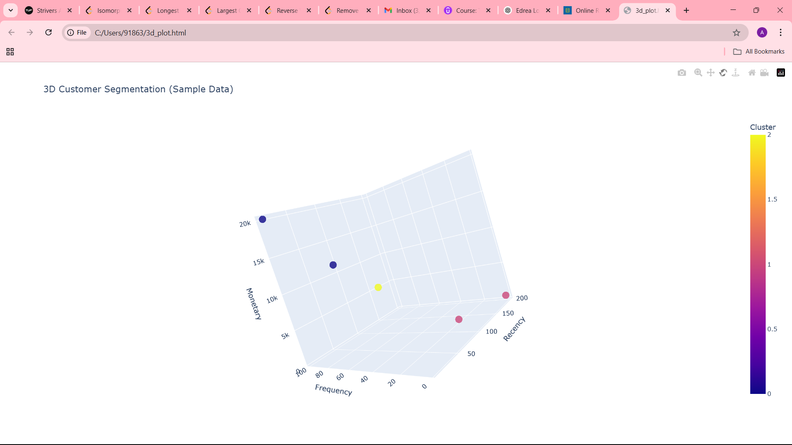

# 🛍️ Customer Segmentation using RFM Analysis

This project performs customer segmentation using **RFM (Recency, Frequency, Monetary)** analysis and **KMeans clustering**, followed by an interactive 3D visualization with **Plotly**. It helps identify customer behavior patterns and potential strategies for targeted marketing.

## 📊 Dataset

- **Source:** UCI Online Retail Dataset  
- **Records:** 500K+ transactions  
- **Fields:** InvoiceNo, Product, Quantity, Price, CustomerID, Country, etc.

## 🔍 Goal

To analyze customer purchasing behavior and segment them into meaningful groups such as:

- **Loyalists**
- **Dormants**
- **Engaged Shoppers**
- **At Risk Customers**

## 🧠 Methodology

1. **Data Cleaning**
   - Handled missing values and canceled orders
2. **RFM Calculation**
   - Calculated Recency, Frequency, and Monetary values per customer
3. **Scoring & Segmentation**
   - Applied quantile-based scoring and KMeans clustering
4. **Persona Assignment**
   - Mapped clusters to behavioral labels (e.g., Dormants, Loyalists)
5. **Visualization**
   - Built 3D interactive cluster plots using Plotly
   - Compared clusters using Seaborn boxplots and bar charts

## 📎 Key Files

| File | Description |
|------|-------------|
| `customer_segmentation_rfm.ipynb` | Full notebook with code & insights |
| `Online Retail.csv` | Cleaned dataset (if public) |
| `3d_plot.html` | Interactive 3D plot (open in browser) |
| `rfm_3d_plot.png` | Screenshot of 3D cluster plot |

---

## 🖼️ Sample Visualization

---

## 📌 Tools & Libraries

- Python
- Pandas, NumPy
- Seaborn, Matplotlib
- Scikit-learn (KMeans)
- Plotly (3D visualization)

---

## 📈 Outcome

- Identified high-value **Loyalist** customers for retention
- Detected **Dormant** and **At-Risk** users for re-engagement
- Built business personas to inform marketing strategy

---

## 🙋‍♂️ Author

**Akash Bellana**  
📧 [akashbellana@gmail.com](mailto:akashbellana@gmail.com)  
🔗 [LinkedIn](https://www.linkedin.com/in/akash-bellana-762374260)  
🔗 [GitHub](https://github.com/AkashBellana)

---

